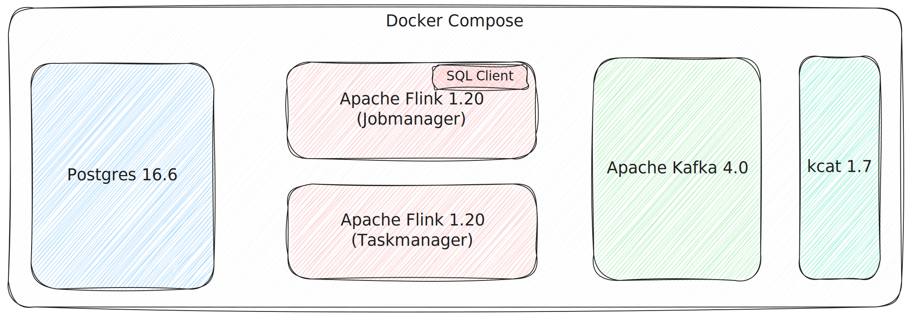

= Apache Kafka, Apache Flink, & Postgres

A Docker Compose for running Postgres, Flink, and Kafka.
Useful for trying out Postgres CDC with Flink and writing to Kafka.

== Usage

=== Kafka

List topics:

[source,bash]
----
docker compose exec -it kcat kcat -b broker:9092 -L
----

Produce data:

[source,bash]
----
docker compose exec -it kcat kcat -b broker:9092 -P -t test -P
----

Consume data:

[source,bash]
----
docker compose exec -it kcat kcat -b broker:9092 -C -t test -c1 -f '\n\tKey (%K bytes): %k
\tValue (%S bytes): %s
\tTimestamp: %T
\tPartition: %p
\tOffset: %o
\tHeaders: %h\n'
----

=== Flink

Flink SQL CLI:

[source,bash]
----
docker compose exec -it jobmanager bash -c "./bin/sql-client.sh"
----

Create a Kafka table:

[source,sql]
----
CREATE TABLE kafka_table (
    `key` STRING,
    `value` STRING
) WITH (
    'connector' = 'kafka',
    'topic' = 'test',
    'properties.bootstrap.servers' = 'broker:9092',
    'format' = 'json',
    'scan.startup.mode' = 'earliest-offset'
);
----

Write data to it

[source,sql]
----
INSERT INTO kafka_table VALUES ('foo','bar');
----

Read the data back

[source,sql]
----
SET 'sql-client.execution.result-mode' = 'tableau';
SELECT * FROM kafka_table;
----

[source,]
----
+----+--------------------------------+--------------------------------+
| op |                            key |                          value |
+----+--------------------------------+--------------------------------+
| +I |                            foo |                            bar |
----

Read the data on the Kafka topic

[source,bash]
----
docker compose exec -it kcat kcat -b broker:9092 -C -t test -c1 -f '\n\tKey (%K bytes): %k
\tValue (%S bytes): %s
\tTimestamp: %T
\tPartition: %p
\tOffset: %o
\tHeaders: %h\n'
----

[source,]
----
Key (-1 bytes):
Value (27 bytes): {"key":"foo","value":"bar"}
Timestamp: 1744366233261
Partition: 0
Offset: 0
Headers:
----

=== Postgres

[source,bash]
----
docker compose exec -it postgres psql -h localhost -p 5432 -U postgres
----

Create an Orders table:

[source,sql]
----
CREATE TABLE orders (
    order_id SERIAL PRIMARY KEY,
    customer_id INTEGER NOT NULL,
    total_amount DECIMAL(10, 2) NOT NULL,
    status VARCHAR(20) NOT NULL,
    created_at TIMESTAMP DEFAULT CURRENT_TIMESTAMP,
    shipped_at TIMESTAMP,
    shipping_address TEXT,
    payment_method VARCHAR(50)
);
----

Add an order:

[source,sql]
----
INSERT INTO orders (customer_id, total_amount, status, created_at, shipping_address, payment_method) VALUES (1001, 149.99, 'pending', '2025-04-25 09:44:25', '221B Baker Street, London', 'Credit Card');
----

=== Set up CDC

In Flink SQL client:

[source,sql]
----
CREATE TABLE orders_cdc (
    order_id INT,
    customer_id INT,
    total_amount DECIMAL(10, 2),
    status STRING,
    created_at TIMESTAMP(3),
    shipped_at TIMESTAMP(3),
    shipping_address STRING,
    payment_method STRING,
    PRIMARY KEY (order_id) NOT ENFORCED
) WITH (
    'connector' = 'postgres-cdc',
    'hostname' = 'postgres',
    'port' = '5432',
    'username' = 'postgres',
    'password' = 'Welcome123',
    'database-name' = 'postgres',
    'schema-name' = 'public',
    'table-name' = 'orders',
    'slot.name' = 'flink_cdc_bork_bork_bork',
    'decoding.plugin.name' = 'pgoutput'
);
----

Query the table:

[source,sql]
----
Flink SQL> SET 'sql-client.execution.result-mode' = 'tableau';
[INFO] Execute statement succeeded.

Flink SQL> SELECT * FROM orders_cdc;
+----+-------------+-------------+--------------+----------+-------------------------+------------+---------------------------+----------------+
| op |    order_id | customer_id | total_amount |   status |              created_at | shipped_at |          shipping_address | payment_method |
+----+-------------+-------------+--------------+----------+-------------------------+------------+---------------------------+----------------+
| +I |           1 |        1001 |       149.99 |  pending | 2025-04-11 11:15:38.301 |     <NULL> | 221B Baker Street, London |    Credit Card |
----

(note that the Flink query keeps on running, since the table is unbounded)

Insert a row in Postgres:

[source,bash]
----
docker compose exec -it postgres psql -h localhost -p 5432 -U postgres \
    -c "INSERT INTO orders (customer_id, total_amount, status, created_at, shipping_address, payment_method) VALUES (1003, 199.50, 'pending', '2025-04-25 09:44:28', '177A Bleecker Street, New York', 'Debit Card');"
----

Flink table shows the new row:

[source,sql]
----
[…]
+----+-------------+-------------+--------------+----------+-------------------------+------------+--------------------------------+----------------+
| +I |           2 |        1003 |       199.50 |  pending | 2025-04-11 11:18:45.417 |     <NULL> | 177A Bleecker Street, New York | Debit Card     |
----

Write the data to Kafka topic

[source,]
----
> CREATE TABLE orders_cdc_kafka WITH (
>     'connector' = 'kafka',
>     'topic' = 'orders_cdc',
>     'properties.bootstrap.servers' = 'broker:9092',
>     'format' = 'json',
>     'scan.startup.mode' = 'earliest-offset'
> ) AS SELECT * FROM orders_cdc;
[ERROR] Could not execute SQL statement. Reason:
org.apache.flink.table.api.TableException: Table sink 'default_catalog.default_database.orders_cdc_kafka' doesn't support consuming update and delete changes which is produced by node TableSourceScan(table=[[default_catalog, default_database, orders_cdc]], fields=[order_id, customer_id, total_amount, status, created_at, shipped_at, shipping_address, payment_method])
----

Use the upsert connector instead:

[source,sql]
----
CREATE TABLE orders_cdc_kafka
    WITH (
    'connector' = 'upsert-kafka',
    'topic' = 'orders_cdc',
    'properties.bootstrap.servers' = 'broker:9092',
    'key.format' = 'json',
    'value.format' = 'json'
) LIKE orders_cdc (EXCLUDING OPTIONS);

INSERT INTO orders_cdc_kafka SELECT * FROM orders_cdc;
----

Check the Kafka topic `orders_cdc` has been written to:

[source,bash]
----
docker compose exec -it kcat kcat -b broker:9092 -L
----

[source,]
----
Metadata for all topics (from broker 1: broker:9092/1):
 1 brokers:
  broker 1 at broker:9092 (controller)
 1 topics:
  topic "orders_cdc" with 3 partitions:
    partition 0, leader 1, replicas: 1, isrs: 1
    partition 1, leader 1, replicas: 1, isrs: 1
    partition 2, leader 1, replicas: 1, isrs: 1
----

[source,bash]
----
docker compose exec -it kcat kcat -b broker:9092 -C -t orders_cdc -c -u -f '\n\tKey (%K bytes): %k
\tValue (%S bytes): %s
\tTimestamp: %T
\tPartition: %p
\tOffset: %o
\tHeaders: %h\n'
----

[source,]
----
        Key (14 bytes): {"order_id":1}
        Value (209 bytes): {"order_id":1,"customer_id":1001,"total_amount":149.99,"status":"pending","created_at":"2025-04-11 11:15:38.301","shipped_at":null,"shipping_address":"221B Baker Street, London","payment_method":"Credit Card"}
        Timestamp: 1744371275207
        Partition: 0
        Offset: 0
        Headers:
% Reached end of topic orders_cdc [1] at offset 0

        Key (14 bytes): {"order_id":2}
        Value (212 bytes): {"order_id":2,"customer_id":1003,"total_amount":199.5,"status":"pending","created_at":"2025-04-11 11:18:45.417","shipped_at":null,"shipping_address":"177A Bleecker Street, New York","payment_method":"Debit Card"}
        Timestamp: 1744371275215
        Partition: 2
        Offset: 0
        Headers:
% Reached end of topic orders_cdc [0] at offset 1
% Reached end of topic orders_cdc [2] at offset 1
----

Write a new row to Postgres:

[source,bash]
----
docker compose exec -it postgres psql -h localhost -p 5432 -U postgres \
    -c "INSERT INTO orders (customer_id, total_amount, status, created_at, shipped_at, shipping_address, payment_method) VALUES (1005, 42.00, 'delivered', '2025-04-25 09:45:33', '2025-05-09 09:15:00', '12 Grimmauld Place, London', 'Bank Transfer');"
----

Observe the new record appear in the Kafka topic:
[source,bash]
----
        Key (14 bytes): {"order_id":3}
        Value (227 bytes): {"order_id":3,"customer_id":1005,"total_amount":42,"status":"delivered","created_at":"2025-04-11 11:35:43.711","shipped_at":"2025-04-09 09:15:00","shipping_address":"12 Grimmauld Place, London","payment_method":"Bank Transfer"}
        Timestamp: 1744371344259
        Partition: 2
        Offset: 1
        Headers:
% Reached end of topic orders_cdc [2] at offset 2
----

Add more records:

[source,sql]
----
INSERT INTO orders (customer_id, total_amount, status, created_at, shipped_at, shipping_address, payment_method) VALUES (1002, 89.95, 'processing','2025-04-25 09:45:38', NULL, '742 Evergreen Terrace, Springfield', 'PayPal');
INSERT INTO orders (customer_id, total_amount, status, created_at, shipped_at, shipping_address, payment_method) VALUES (1004, 125.50, 'delivered', '2025-04-25 09:46:03','2025-04-15 14:30:00', '31 Spooner Street, Quahog', 'Credit Card');
----

=== Exploring Watermarks

[source,sql]
----
CREATE TABLE `orders_kafka` (
    `order_id` INT NOT NULL,
    `customer_id` INT,
    `total_amount` DECIMAL(10, 2),
    `status` VARCHAR(2147483647),
    `created_at` TIMESTAMP(3),
    `shipped_at` TIMESTAMP(3),
    `shipping_address` VARCHAR(2147483647),
    `payment_method` VARCHAR(2147483647),
    `topic_partition` INT METADATA FROM 'partition',
    WATERMARK FOR `created_at` AS `created_at` - INTERVAL '5' SECOND,
    CONSTRAINT `PK_order_id` PRIMARY KEY (`order_id`) NOT ENFORCED
) WITH (
    'properties.bootstrap.servers' = 'broker:9092',
    'connector' = 'upsert-kafka',
    'value.format' = 'json',
    'key.format' = 'json',
    'topic' = 'orders_cdc',
    'scan.watermark.idle-timeout' = '30 sec'
);
----
