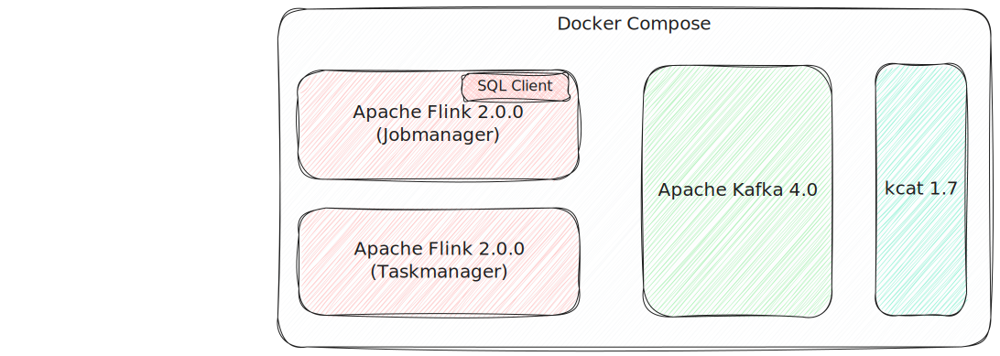

= Apache Flink & Apache Kafka

A Docker Compose for running Flink and Kafka.

== Usage

=== Kafka

List topics:

[source,bash]
----
docker compose exec -it kcat kcat -b broker:9092 -L
----

Produce data:

[source,bash]
----
docker compose exec -it kcat kcat -b broker:9092 -P -t test -P
----

Consume data:

[source,bash]
----
docker compose exec -it kcat kcat -b broker:9092 -C -t test -c1 -f '\n\tKey (%K bytes): %k
\tValue (%S bytes): %s
\tTimestamp: %T
\tPartition: %p
\tOffset: %o
\tHeaders: %h\n'
----

=== Flink

Flink SQL CLI:

[source,bash]
----
docker compose exec -it jobmanager bash -c "./bin/sql-client.sh"
----

Create a Kafka table:

[source,sql]
----
CREATE TABLE kafka_table (
    `key` STRING,
    `value` STRING
) WITH (
    'connector' = 'kafka',
    'topic' = 'test',
    'properties.bootstrap.servers' = 'broker:9092',
    'format' = 'json',
    'scan.startup.mode' = 'earliest-offset'
);
----

Write data to it

[source,sql]
----
INSERT INTO kafka_table VALUES ('foo','bar');
----

Read the data back

[source,sql]
----
SET 'sql-client.execution.result-mode' = 'tableau';
SELECT * FROM kafka_table;
----

[source,]
----
+----+--------------------------------+--------------------------------+
| op |                            key |                          value |
+----+--------------------------------+--------------------------------+
| +I |                            foo |                            bar |
----

Read the data on the Kafka topic

[source,bash]
----
docker compose exec -it kcat kcat -b broker:9092 -C -t test -c1 -f '\n\tKey (%K bytes): %k
\tValue (%S bytes): %s
\tTimestamp: %T
\tPartition: %p
\tOffset: %o
\tHeaders: %h\n'
----

[source,]
----
Key (-1 bytes):
Value (27 bytes): {"key":"foo","value":"bar"}
Timestamp: 1744366233261
Partition: 0
Offset: 0
Headers:
----
