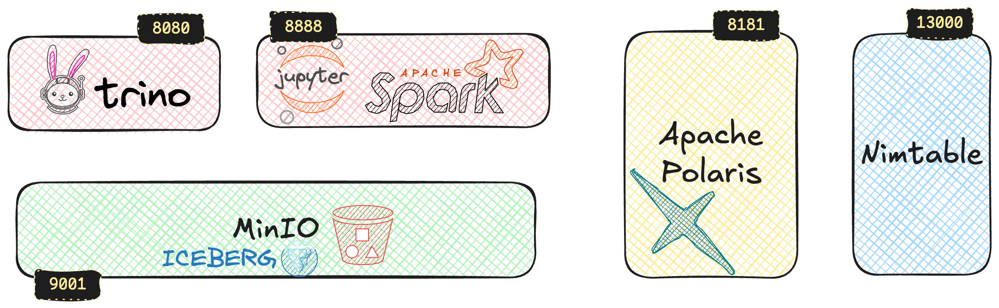

= Iceberg + Polaris + MinIO + Trino + Spark == FUN 🥳

Kudos to my colleague Gilles Philippart for building this! Read more on his https://medium.com/@gilles.philippart/349c534ecd98[excellent blog post].

== Setup

[source,bash]
----
docker compose up
----

* Trino
+
Web UI for monitoring: http://localhost:8080 (login: `admin`)
+
SQL client: `docker compose exec trino trino --server localhost:8080 --catalog iceberg`

* Jupyter notebook w/Spark
+
http://localhost:8888/notebooks

* MinIO
+
Web UI: http://localhost:9000 (login: `admin` / `password`)
+
CLI: `docker compose exec minio-client mc`
+
e.g.
`docker compose exec minio-client mc ls -r minio/warehouse/db`

* Polaris
+
No UI, but you can use Nimtable for WebUI, or use the API directly.
+
The `polaris-config` container configures Polaris using the `setup.sh` script to set up security and create an initial namespace.

* Nimtable
+
Web UI: http://localhost:13000 (login: `admin` / `admin`)

== More details

See https://rmoff.net/2025/07/14/keeping-your-data-lakehouse-in-order-table-maintenance-in-apache-iceberg/[Keeping your Data Lakehouse in Order: Table Maintenance in Apache Iceberg]
